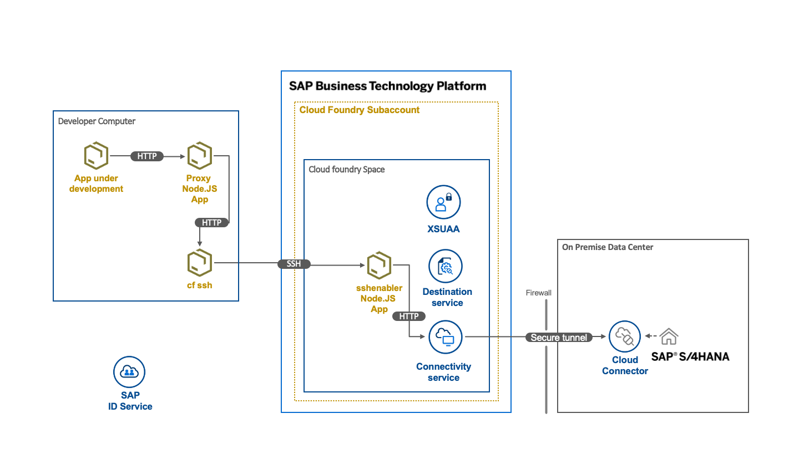
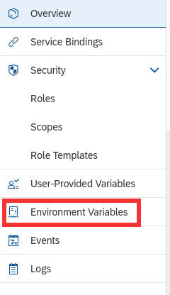

# sap-cf-proxy - proxy to all destinations in SAP BTP Cloud Foundry subaccount

## Why?

You might ask why do I need this project? The answer is whenever you want to work with on-premise destinations or a system connected through a Cloud Connector and you don't have a VPN connection which would allow you to connect directly. But please note that you don't need this project when you're working with SAP Business Application Studio and you have a Cloud Connector connected to the subaccount BAS is running in.

## Limitations

The authentication of the SAP BTP Cloud Foundry subaccount must be configured to use SAP ID or SAP Identity Authentication. For SAP Identity Authentication you must have the credentials of a local user.

## How does it work



This proxy makes use of the possibility to connect via ssh into an app (sshenabler) that is running inside the SAP BTP Cloud Foundry environment. From there the so-called connectivity proxy is reachable. This proxy is provided by an instance of the Connectivity Service. On your development computer you have to start two programs:

- the script that establishes the ssh tunnel and forwards requests from the local port 20003 and 20004 to connectivityproxy.internal.cf.eu10.hana.ondemand.com:20003 / 20004
- the reverse proxy that by default listens on port 5050 and acts as your local endpoint for calls that should be forwarded to the on premise system

When your local app that you develop e.g. a CAP Application using an external service, a SAPUI5 App or a REST Client Script sends a request to the proxy, it will either use the username / password provided as an basic authentication header or via the environment variables USERNAME / PASSWORD and use that to authenticate on the XSUAA service using the password grant type. In return a JWT is retrieved. This token is sent in the backend request and is translated to the X.509 certificate used for principal propagation in the Cloud Connector. The local reverse proxy sends request for an on premise destination to local port that are forwarded via the ssh tunnel to the proxy in the BTP.

When you want to directly connect to e.g. a database running on-premise (Sybase ASE, Postgres, HANA) then this repository provides a proxy that tunnels TCP requests through to the database.

## Prerequisites

You are logged into your SAP BTP Cloud Foundry subaccount [via the cf CLI](https://blogs.sap.com/2021/04/21/connecting-from-sap-business-application-studio-to-sap-btp-cloud-foundry-environment/) and you have the [Multitarget Build Tool](https://sap.github.io/cloud-mta-build-tool/download/) installed (mbt).

## Installation

Clone the repository to a directory of your choice:

```bash
git clone git@github.com:jowavp/sap-cf-proxy.git
```

## Setup

Run the following commands in a terminal window in the `sap-cf-proxy` directory :

```bash
npm install
npm run build:mta
npm run deploy:cf
npm run enable-ssh
```

### Connectivity Proxy

> By default the script `start-sshtunnel` is configured to forward the requests to:
> `'connectivityproxy.internal.cf.eu10.hana.ondemand.com:20003'` .

Open the SAP BTP Cockpit and navigate to the details of the deployed app _sshenabler_. Open the Environment Variables of this app. They can be found by opening the cloud foundry space in the correct sub-account. Click on the deployed application `sshenabler` and click on the `Environment Variables` in the left-hand menu.



Copy the content of the textbox _System Provided_ to a file named _default-env.json_ in the root folder of this project.
Only the `"VCAP_SERVICES"` section is required. **Do not add** the `"VCAP_APPLICATION"` section.

The hostname or IP address you are looking for is named `onpremise_proxy_host` in the `VCAP_SERVICES` Environment Variable of the `sshenabler` application.

Update the following section in `package.json` with the hostname or IP address:

```json
  "config":{
    "proxy": "connectivityproxy.internal.cf.eu10.hana.ondemand.com"
  },
```

Once this configuration is complete you can now run:

```bash
npm run start:sshtunnel
```

The result should be something like:

```bash

> sap-cf-proxy@0.0.2 start:sshtunnel
> cf ssh sshenabler -L 20003:$npm_package_config_proxy:20003 -L 20004:$npm_package_config_proxy:20004

vcap@<guid>:~$
```

and you will be able to enter commands on the server if you wish.

### Forward HTTP requests (CAP, UI5)

Once you have created the local _default-env.json_ as described above, in another terminal window of the sap-cf-proxy app run:

```bash
npm start
```

### Forward TCP data (Database connection)

Go to the SAP BTP Cockpit and open the details of the deployed app _sshenabler_. Navigate there to the Environment Variables. Copy the content of the textbox _System Provided_ to a local file called _default-env.json_ in the directory _socks-proxy_.

Then run the following commands in another terminal window. Make sure to change ON_PREMISE_HOST and ON_PREMISE_PORT to values that you see in the Cloud Connector configuration.

```bash
cd socks-proxy
mvn compile
ON_PREMISE_HOST=hostnameOfOnPremiseSystem ON_PREMISE_PORT=portOfOnPremiseSystem VCAP_SERVICES=$(jq '.VCAP_SERVICES' default-env.json|jq -c .) mvn compile exec:java -Dexec.mainClass="StartSocksProxy"
```

Now you can open your preferred database tool or also your application that uses JDBC to connect and just point it to _localhost:5050_.

## Proxy Configuration (valid for HTTP request forwarding)

Following properties can be configured in a .env file in the root folder of the project.

| Property                  | Description                                                                                | Defaul value          |
| ------------------------- | ------------------------------------------------------------------------------------------ | --------------------- |
| PORT                      | Proxy port                                                                                 | 5050                  |
| DESTINATION_PROPERTY_NAME | Header property to define the target destination                                           | X-SAP-BTP-destination |
| DEFAULT_DESTINATION       | If no target destination is set in the request to the proxy we use this destination nama.  | SAP_ABAP_BACKEND      |
| CFPROXY_HOST              | Host where the port-forwarding is running to the CF proxy                                  | 127.0.0.1             |
| CFPROXY_POST              | Port that is forwarded to the CF proxy                                                     | 20003                 |
| USERNAME                  | Username in cloud foundry, if no user is set you have to send an authorization header.     |
| PASSWORD                  | Password in cloud foundry, if no password is set you have to send an authorization header. |

## Testing

Using the VS Code Extension [REST Client](https://marketplace.visualstudio.com/items?itemName=humao.rest-client) you can execute the test in test/ping.http. Before you can run the test you have to create a .env file in the test folder with the following (of course adjusted) content:

```env
sapcpproxy=http://localhost:5050
sapid_username="<user-email>"
sapid_password="<password>"
sapclient=<SAP Client>
```

Connect a Cloud Connector to your Subaccount and create the following destinations:

- SAP_ABAP_BACKEND_NO_AUTH
- SAP_ABAP_BACKEND_BASIC_AUTH

Then run the test. The result should be:

`<html><body>Server reached.</body></html>`

in both cases.

## Troubleshooting

If you start the sshtunnel with `npm run start:sshtunnel` and get the following error:

```bash
Error opening SSH connection: You are not authorized to perform the requested action.
```

then you need to:

```bash
cf enable-ssh sshenabler;
cf restart sshenabler;
```

Other troubleshooting is [available](https://blogs.sap.com/2018/09/12/ssh-into-cloudfoundry-trouble/)

## update modules @todo

Currently the following warning are emmited on `npm i`

The deprecated libraries need to be updated.

```txt
npm WARN deprecated @types/pino@7.0.5: This is a stub types definition. pino provides its own type definitions, so you do not need this installed.
npm WARN deprecated babel-preset-es2015@6.24.1: 🙌  Thanks for using Babel: we recommend using babel-preset-env now: please read https://babeljs.io/env to update!
npm WARN deprecated @sap-cloud-sdk/analytics@1.54.2: 1.x is no longer maintained.
npm WARN deprecated @sap-cloud-sdk/util@1.54.2: 1.x is no longer maintained.
npm WARN deprecated @sap-cloud-sdk/core@1.54.2: Version 1 of SAP Cloud SDK is no longer maintained. Check the upgrade guide for switching to version 2: https://sap.github.io/cloud-sdk/docs/js/guides/upgrade-to-version-2.
npm WARN deprecated core-js@2.6.12: core-js@<3.23.3 is no longer maintained and not recommended for usage due to the number of issues. Because of the V8 engine whims, feature detection in old core-js versions could cause a slowdown up to 100x even if nothing is polyfilled. Some versions have web compatibility issues. Please, upgrade your dependencies to the actual version of core-js.


```
